# Проект - Pooh JMS

# Содержание
* [Использованные технологии](#Использованные-технологии)
* [О проекте](#О-проекте)
* [Сборка](#Сборка)
* [Использование](#Использование)
* [Контакты](#Контакты)
## Использованные технологии
* Java Concurrency (классы из пакета java.util.concurrent)
* Collections Framework
* Библиотека GSON
* Sockets
* Java IO
* Checkstyle plugin
* JaCoCo
* Travis CI
## О проекте
В данном проекте написан код сервера и двух клиентов на сокетах.   
Сервер представляет собой систему обмена сообщениями 
и построен на базе потокобезопасных классов из пакета *java.util.concurrent*.  
Клиенты могут как отправлять так и принимать сообщения. Сообщения передаются в формате JSON 
(для работы с данным форматом используется *библиотека GSON*). На каждого клиента создаётся своя нить.   
Интерфейс системы консольный.  
Система может работать в двух режимах:
* __*Режим Queue*__ - все клиенты записывают (отправляют сообщения) и читают (получают сообщения) из одной и той же очереди.
Примеры запросов на отправку и получение сообщения:  
*POST /queue {"queue":weather,"text":temp}* 
*GET /queue/weather*  
где weather - название очереди (можно использовать произвольные названия); text - текст сообщения.  
* __*Режим Topic*__ - у каждого клиента своя собственная очередь. Другими словами, каждый клиент читает из своей собственной очереди, 
но также может записывать (отправлять сообщения) в очереди всех остальных клиентов.
Примеры запросов на отправку и получение сообщения:  
*POST /topic {"topic":weather,"text":temp}* 
*GET /topic/weather*  
где weather - название очереди (можно использовать произвольные названия); text - текст сообщения.  
Для завершения работы клиента нужно ввести команду *Exit*.  
Общая диаграмма зависимостей компонентов сервера:  
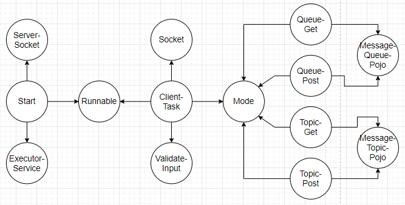  
1. Класс __*Start*__ - главный класс системы. Инициализирует необходимые потокобезопасные коллекции 
из *пакета java.util.concurrent* (*ConcurrentHashMap*, *BlockingQueue*), 
запускает сервер на порту 9000 на *ServerSocket*, для каждого клиента создаёт отдельную нить с помощью объекта *ExecutorService*.
2. Класс __*ClientTask*__ - реализует интерфейс Runnable, инкапсулирует в себе сокет клиента и соответствует задаче, выполняемой нитью клиента.
Валидирует поступающие от клиентов запросы и запускает необходимый режим работы системы.
3. Интерфейс __*Mode*__ - за счёт данного интерфейса возможно расширение системы (добавление новых режимов работы). 
Реализуется классами *QueueGet*, *QueuePost*, *TopicGet*, *TopicPost*, которые соответствуют различным режимам работы системы.
4. Классы __*MessageQueuePojo*__, __*MessageTopicPojo*__ - модели данных, соответствующие сообщениям.
5. Классы __*QueueGet*__, __*QueuePost*__, __*TopicGet*__, __*TopicPost*__ - соответствуют различным режимам работы системы.
Используют *библиотеку GSON* для работы с сообщениями.  
Общая диаграмма зависимостей компонентов клиента:  
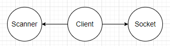  
В коде клиента используется класс *java.util.Scanner* для обработки ввода от пользователя, 
а также класс *java.net.Socket* для взаимодействия с сервером.
## Сборка
1. Установить JDK 14.
2. Скачать Maven.
3. Создать переменные окружения JAVA_HOME и M2_HOME и прописать в переменную окружения Path 
пути до бинарных файлов для JDK и для Maven:  
  
4. Скачать исходный код проекта с GitHub.
5. Перейти в корень проекта, где лежит файл pom.xml:  
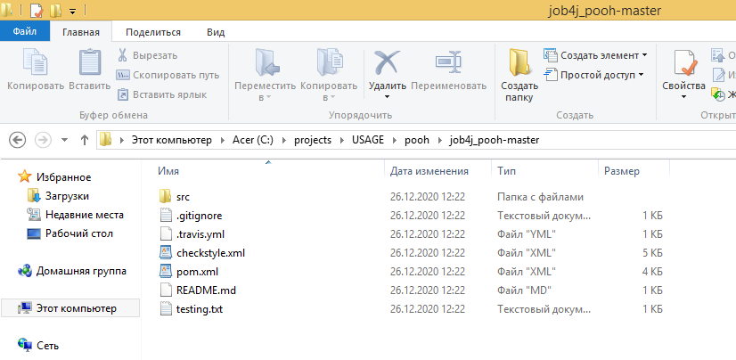 
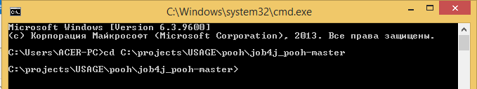  
6. С помощью Maven осуществить сборку проекта:  
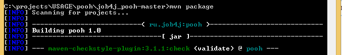  
При успешной сборке должна появиться папка target, в которой располагается jar-архив pooh.jar:  
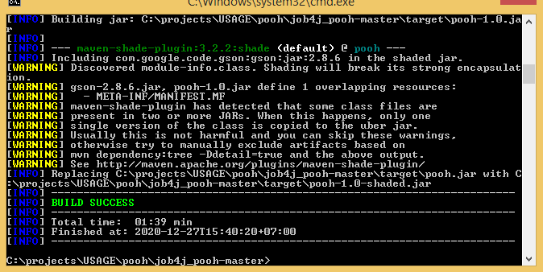 
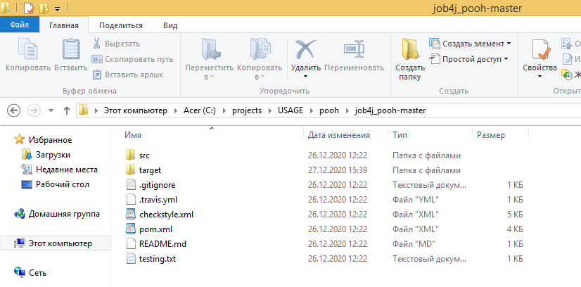 
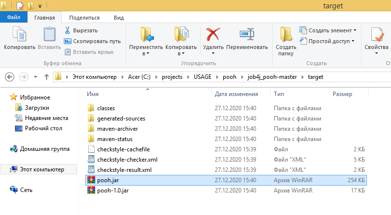  
Сборка завершена. Теперь можно проверить работу системы.
## Использование
Запустим сервер:  
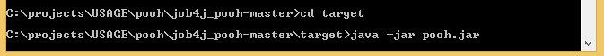  
Код клиентов располагается в папке target по пути classes/ru/job4j/pooh/clients.
Для запуска клиентов необходимо указать classpath, а также полное имя классов клиентов.  .
Открываем новую консоль. Запускаем первого клиента (ClientGet):  
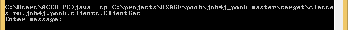  
Открываем новую консоль. Запускаем второго клиента (ClientPost):  
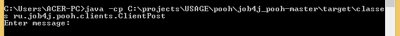  
Теперь можно проверить режимы работы системы. 
Текст проверочных запросов можно найти в файле testing.txt, который расположен в корне проекта.  
1. __*Режим Queue.*__  

Проверим валидацию. Введём некорректные данные:  
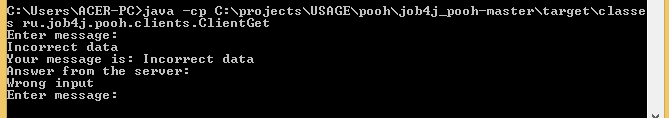  
Как видно, валидация работает исправно.  
Запостим 2 сообщения первым клиентом и одно сообщение вторым клиентом в очередь с названием weather:  
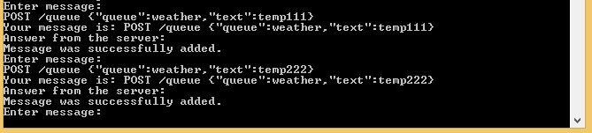  
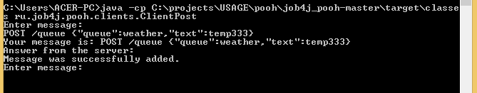  
Теперь считаем 1 сообщение первым клиентом и 2 сообщения вторым клиентом из очереди weather:  
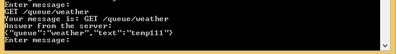  
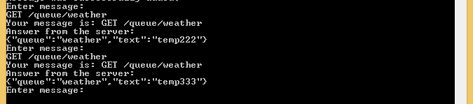  
Так как теперь очередь weather пуста, то считать сообщения из данной очереди не удастся:  
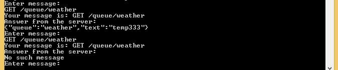  
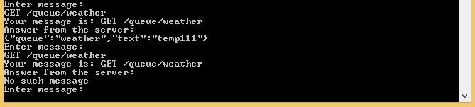  
Как видно, режим Queue работает корректно.  
2. __*Режим Topic.*__  

Запостим 2 сообщения первым клиентом и одно сообщение вторым клиентом в очередь с названием weather:  
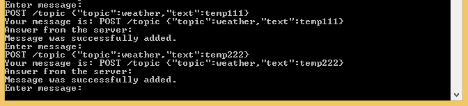  
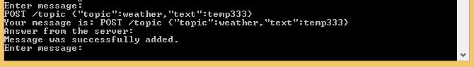  
Считаем все сообщения, имеющиеся в очереди weather первого клиента:  
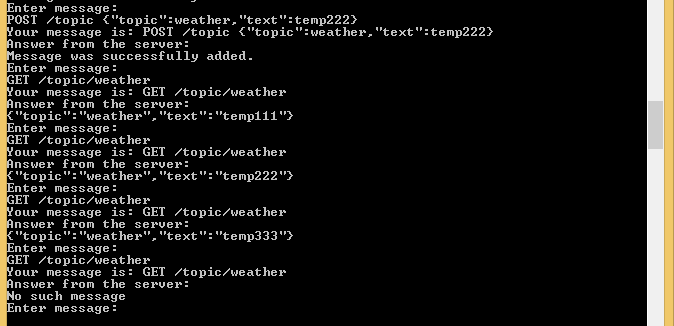  
Сделаем то же самое для второго клиента:  
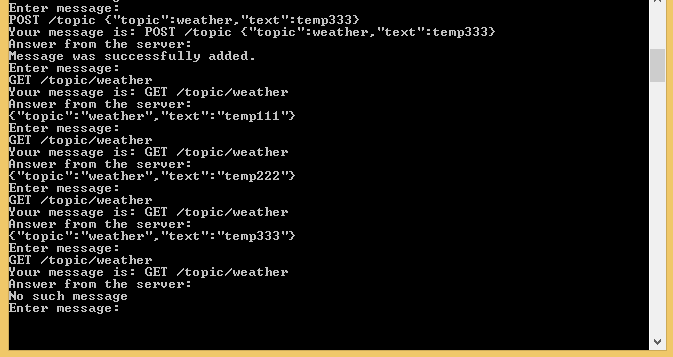  
Как видно, режим Topic работает корректно.  
Для выхода вводим у обоих клиентов команду Exit:  
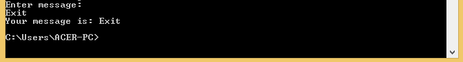
## Контакты
Почта: dmitry_yugay@mail.ru 
Skype: live:.cid.9cdc925fb48220b4
